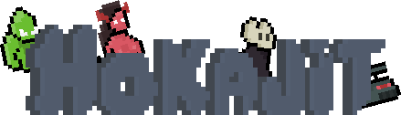

    

##  

> [!Note]
> Jeu 2D en pixel-art, actuellement **en développement** sous le moteur de jeu [Ratelite](https://github.com/MrSinaf/Ratelite).

### o((>ω< ))o Priorité
Hokajit a pour objectif d'être composé de deux modes de jeux : un RTS et un JDR.\ 
Pour des raisons d'efficacité, le JDR sera développé en premier.

### > Attributions (✿◡‿◡) <
| Chemins                | Sources                                                                                  |
|------------------------|------------------------------------------------------------------------------------------|
| purrvert.wav (modifié) | https://pixabay.com/sound-effects/nature-sound-effect-cat-chirruping-and-meowing-282902/ |
| ari-w9500--*.ttf       | https://www.dafont.com/ari-w9500.font                                                    |

    

